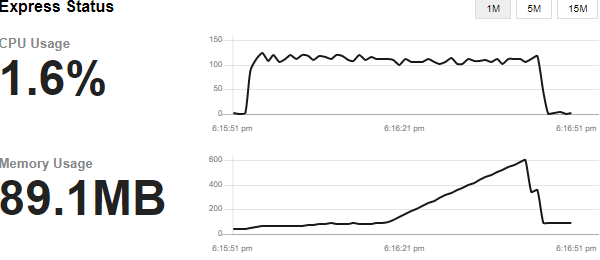
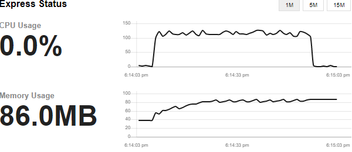
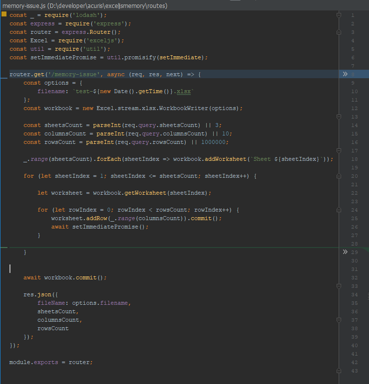
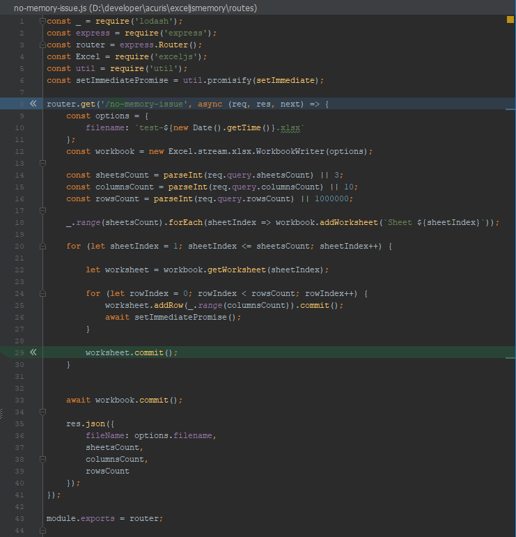

# How to run
It's a NodeJS web application. It listens on port 3000 by default. Run following commands to start the app.
- npm install
- npm start

# How it works
This application exposes 3 endpoints:

http://localhost:3000/status
 Exposes live memory profiling.

http://localhost:3000/no-memory-issue?rowsCount=500000&columnsCount=10&sheetsCount=2
 Enables to trigger example process that would generate xlsx file without memory issue

http://localhost:3000/no-memory-issue?rowsCount=500000&columnsCount=10&sheetsCount=2
 Enables to trigger example process that would generate xlsx file with memory issue

# Issue description
The library has problem to release memory on `row.commit()` if there is a previous `worksheet` that is not commited.
By "previous" I mean worksheet with lower index.

# Why this is a problem?
I have process that fetch data page by page. Based on each page I write data to all `worksheets`, so I cannot commit worksheet before I write all data from all pages. That leads to memory issue on server.

# Results
|Without `worksheet.commit()` | With `worksheet.commit()`|
|------------ | -------------|
|Max memory consumed: ~600MB | Max memory consumed: ~85MB| 
|||
|||
